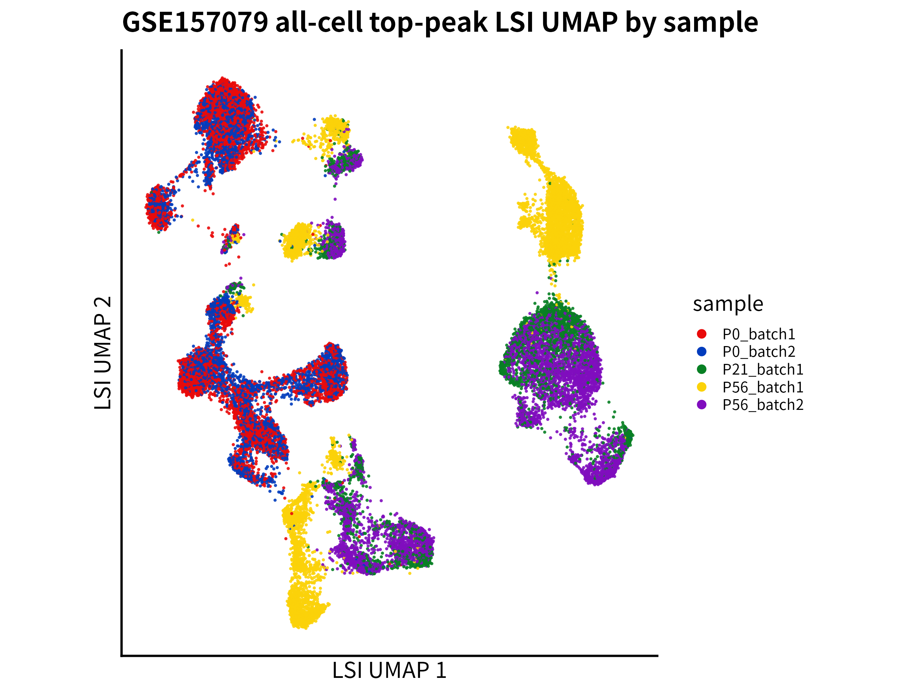
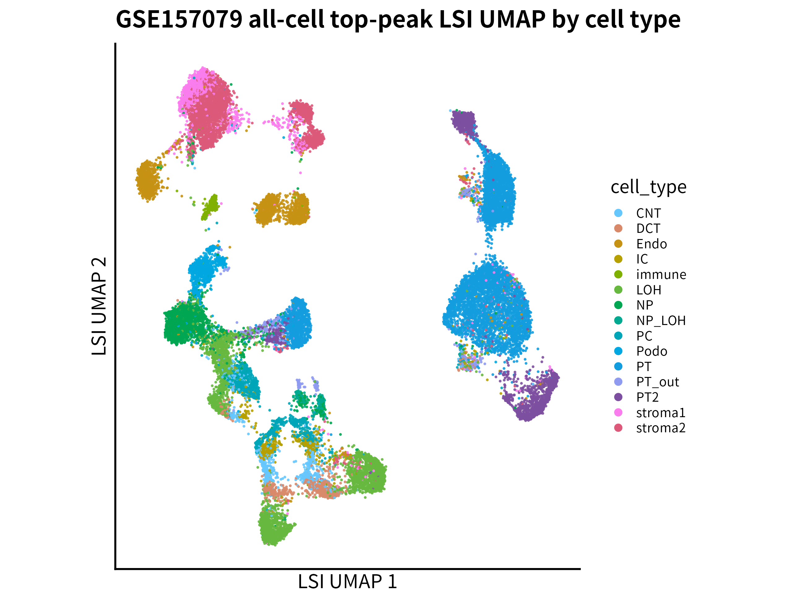
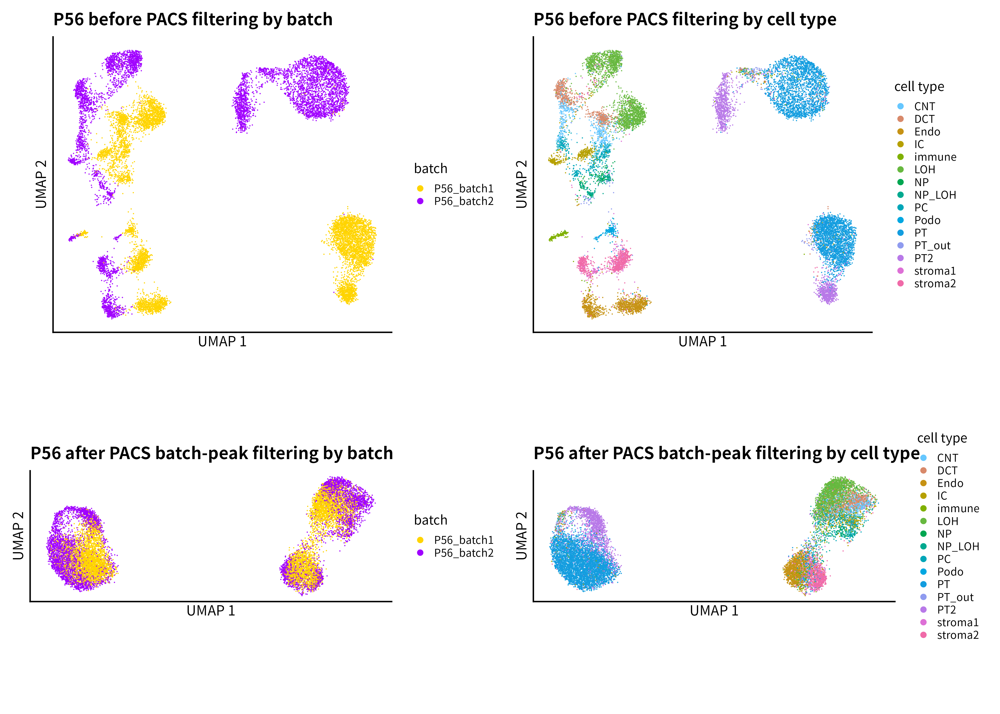
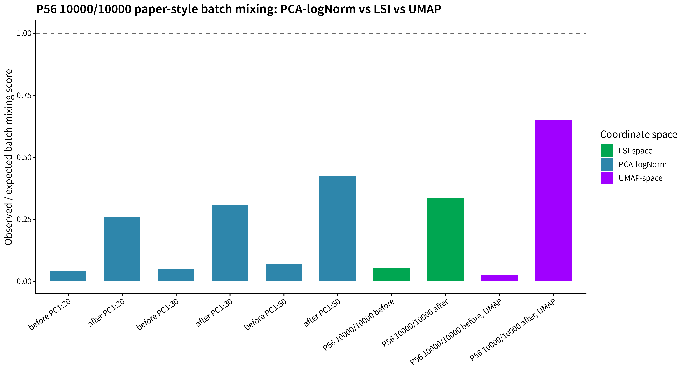

# PACS 论文复现项目

本仓库用于复现 PACS 论文中的关键分析流程，重点围绕 **scATAC-seq 中 batch-effect features 的检测、过滤与 UMAP 重建**。当前项目已经完成两个主要阶段：

1. **Notebook 1 benchmark 复现**：复现 PACS 主方法在 real kidney benchmark 中的 Type I error / power workflow。
2. **GSE157079 mouse kidney reconstruction**：从公开 GSE157079 mouse kidney snATAC 数据出发，完成原始矩阵接入、matrix-derived UMAP、P56 子集 PACS batch-effect peak filtering 与 before/after UMAP 展示。

当前结果应理解为 **P56 two-batch top10000 setting 下的 Fig.3a–d author-style reconstruction**，不是 PACS 原文 Fig.3 的 exact full reproduction。

## 项目定位

PACS 论文 Fig.3a–d 的核心逻辑是：

```text
原始 chromatin accessibility features
→ 使用 PACS 检测 batch-effect features
→ 移除显著 batch-associated features
→ 重新构建 UMAP
→ 比较 batch mixing 与 cell-type structure preservation
```

本项目目前聚焦于 P56 adult-like mouse kidney 子集中的两个 batch：

| 项目 | 当前设置 |
|---|---|
| 数据 | GSE157079 mouse kidney snATAC |
| 子集 | P56_batch1 + P56_batch2 |
| 细胞数 | 13,526 |
| 主 feature universe | top 10,000 detected peaks |
| PACS 检验 | full: `~ cell_type + batch`; null: `~ cell_type` |
| FDR cutoff | 0.05 |
| 当前定位 | Fig.3a–d author-style reconstruction |

---

## 主要结果一：Notebook 1 benchmark

PACS 主方法在 large benchmark run 中达到较好的 Type I error 控制与 power。baseline 方法为 clean-room reimplementation，因为作者原始 baseline helper 文件未能定位。

| method | Type I error | power | 说明 |
|---|---:|---:|---|
| our / PACS | 0.04008 | 0.83337 | PACS 主方法，接近作者 Notebook |
| seurat | 0.06342 | 0.82344 | clean-room baseline |
| archR | 0.04096 | 0.67437 | clean-room approximate baseline |
| snapATAC | 0.01810 | 0.76094 | clean-room edgeR-style baseline |
| fisher | 0.02208 | 0.76630 | binary Fisher exact test |


---

## 主要结果二：GSE157079 原始矩阵接入

已确认 GSE157079 metadata、peak list 与 cell-by-peak MatrixMarket 稀疏矩阵对齐。

| 对象 | 数值 |
|---|---:|
| cells | 28,316 |
| peaks | 300,755 |
| nonzero entries | 166,121,193 |
| metadata rows | 28,316 |
| peak list rows | 300,755 |
| matrix orientation | cell × peak |

关键修复包括：

- 使用 `row_index` 合并 metadata 与 GEO UMAP coordinates。
- 不将 10x-style `cell_barcode` 作为全局唯一键，因为 barcode 可跨 sample 重复。
- 大型 `.gz` matrix 文件通过流式方式读取，不解压原始数据。

---

## 主要结果三：从原始矩阵重建 all-cell top-peak UMAP

从 GSE157079 原始 cell-by-peak matrix 出发，使用 top 20,000 detected peaks 完成 TF-IDF / LSI / UMAP 重建。该结果不是 all-features UMAP，也不是 PACS-filtered UMAP，而是用于验证 matrix-derived pipeline 可行性的 all-cell top-peak reference embedding。

| 项目 | 数值 |
|---|---:|
| cells | 28,316 |
| selected top peaks | 20,000 |
| retained nonzeros | 85,801,336 |
| sparse matrix | 28,316 × 20,000 |
| LSI dimension | 28,316 × 50 |
| UMAP input | LSI_2:LSI_30 |

<p align="center">
  
  
</p>

完整 all-features UMAP 已尝试运行，但在完整读取 166,121,193 个非零坐标后，于 sparse Matrix 构建阶段被系统终止，推测主要原因是内存压力。因此当前报告与 README 均将该结果表述为 **all-cell top-peak matrix-derived UMAP**。

---

## 主要结果四：P56 PACS batch-effect peak filtering

P56 子集包含两个 batch，适合在同一发育时期背景下检测批次效应相关 peaks，避免将 P0/P21/P56 发育差异误解释为技术 batch effect。

| 项目 | 数值 |
|---|---:|
| P56 cells | 13,526 |
| P56_batch1 | 7,129 |
| P56_batch2 | 6,397 |
| cell types | 15 |
| n_top_peaks | 10,000 |
| tested peaks | 10,000 |
| significant batch peaks | 6,305 |
| retained peaks | 3,695 |
| FDR cutoff | 0.05 |

当前主图为 P56 before/after UMAP 四联图：



解释：

- before by batch：P56_batch1 与 P56_batch2 呈现明显 batch separation。
- after by batch：移除 PACS-significant batch peaks 后 batch separation 减弱。
- before/after by cell type：用于检查 biological cell-type structure 是否仍然保留。

---

## 主要结果五：normalized batch mixing score

为避免仅凭 UMAP 视觉判断，本项目在三个坐标空间中计算 paper-style normalized batch mixing score。

| 坐标空间 | before | after | 解释 |
|---|---:|---:|---|
| PCA-logNorm PC1:30 | 0.0510 | 0.3097 | 最接近原文 normalized PCA mixing 的主指标 |
| PCA-logNorm PC1:50 | 0.0685 | 0.4239 | PCA 维度敏感性结果 |
| LSI_2:30 | 0.0520 | 0.3343 | scATAC-aware supporting metric |
| UMAP-space | 0.02649 | 0.65073 | visualization-level auxiliary metric |



三类空间均显示 PACS filtering 后 batch mixing score 提高，说明改善并不只是 UMAP visualization artifact。

---

## 主要结果六：LSI_1-depth QC

LSI_1 与细胞测序深度高度相关，因此在 LSI-space mixing score 中排除 LSI_1，使用 LSI_2:30 作为主要 LSI 空间是有依据的。

| stage | component | Spearman(depth) | Pearson(depth) |
|---|---|---:|---:|
| before | LSI_1 | -0.9983 | -0.9739 |
| after | LSI_1 | 0.9976 | 0.9830 |


---

## 当前结论

在 P56 two-batch top10000 setting 中，PACS 在控制 cell type 后识别出大量 batch-associated accessibility peaks。移除这些 peaks 后，batch mixing 在 PCA-logNorm、LSI 与 UMAP 三类坐标空间中均显著改善，同时细胞类型结构仍然具有可解释性。当前结果支持 PACS 用于真实 snATAC 数据中 batch-effect feature detection 与 filtering 的核心逻辑。

需要注意：当前结果仍是 **P56-only、top-peak、depth-derived cap_rates** 条件下的阶段性 reconstruction，不直接等同于作者完整 Fig.3。

---

## AI 辅助与个人工作说明

本项目采用 **human-AI collaborative reproduction workflow**。ChatGPT 和 Codex 主要辅助复现路线规划、代码撰写、错误分析、脚本整理、报告初稿和图表组织；本人负责研究问题选择、复现目标确定、运行环境维护、关键 Linux/R 命令执行、结果核验、参数决策、科学解释和最终汇报把关。

该说明旨在保证学术沟通中的透明性：AI 工具承担了较多实现和组织层面的工作，但研究路线取舍、结果判断和最终解释由本人负责。

---

## 目录说明

```text
scripts/
```

项目脚本目录。

```text
scripts/mouse_kidney_figures/
```

GSE157079 intake、matrix alignment、matrix-derived UMAP、P56 PACS filtering 和 batch mixing quantification 脚本。

```text
results/
```

Notebook 1 benchmark、GSE157079 中间结果、定量报告和阶段性总结。

```text
figures/mouse_kidney/
```

Notebook 1 图、GSE157079 UMAP、P56 PACS before/after UMAP 和定量指标图。

```text
report/pdf_report/
```

阶段性中文报告、HTML/PDF 渲染文件及报告材料。

---

## 后续计划

1. 继续完善 Fig.3a–d：更接近作者的 adult kidney setting、feature universe 与 PCA preprocessing。
2. 推进 Fig.3e/f：PCT/PST-specific peaks、peak-to-gene annotation、IGV-like track 和 scRNA expression heatmap。
3. 在更大内存环境下尝试 true all-features UMAP，或明确将 top-peak reconstruction 作为 computationally tractable approximation。
