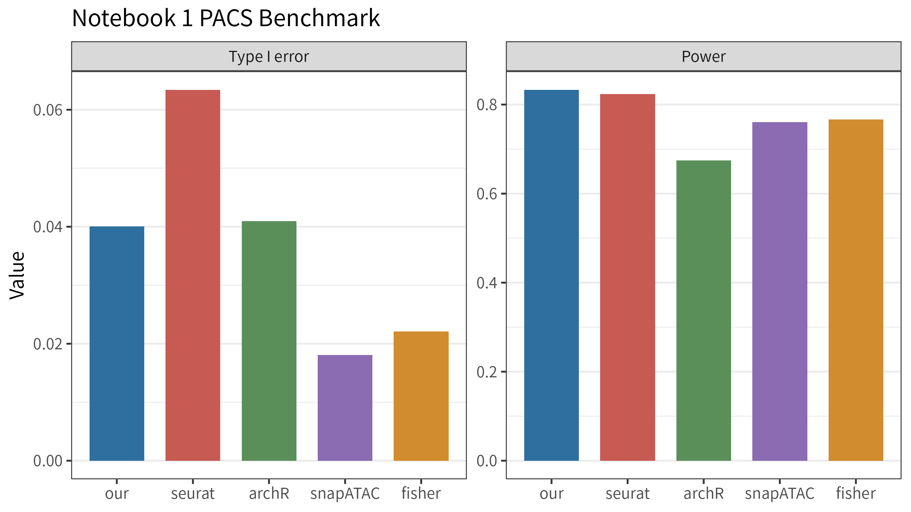
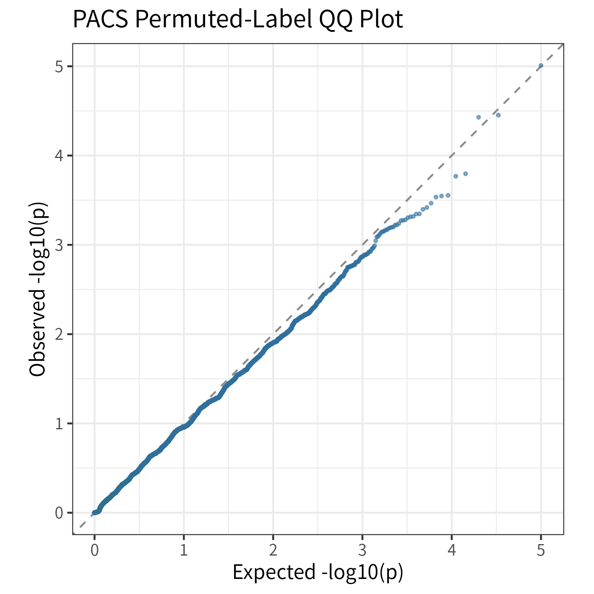
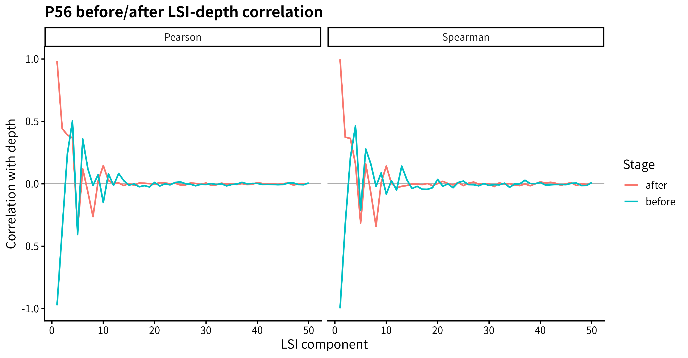
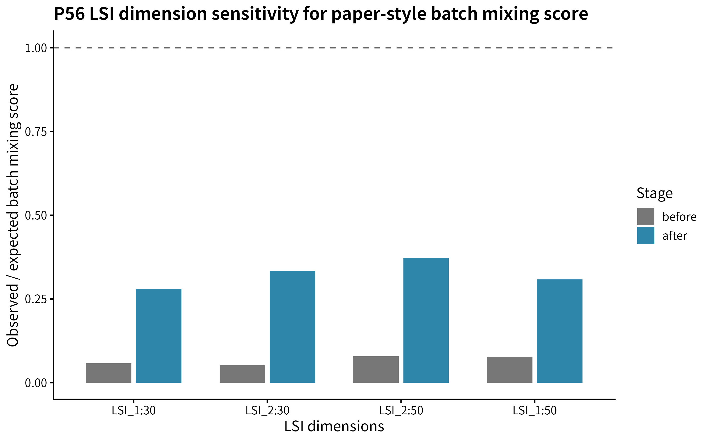
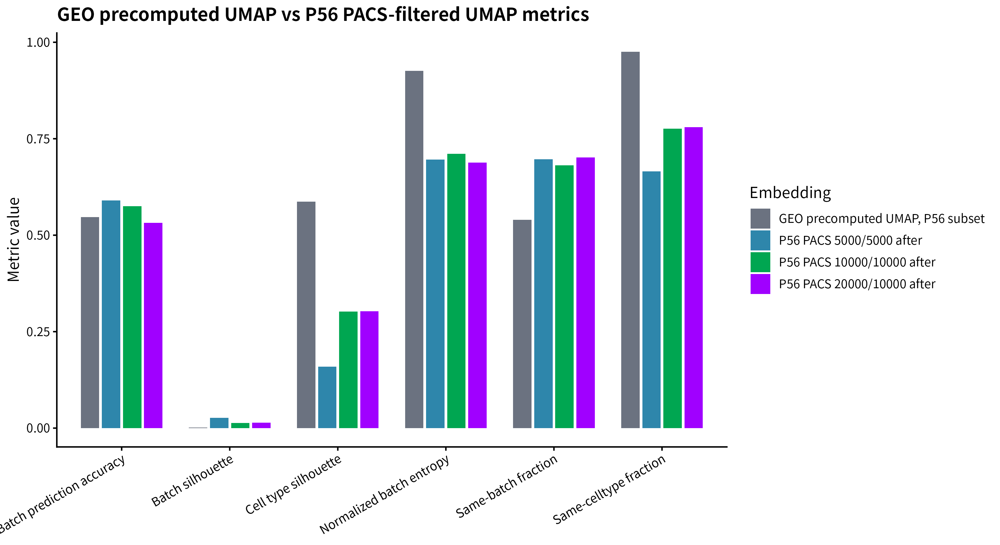

# PACS 复现项目阶段报告：GSE157079 UMAP 重建与 P56 批次效应特征去除

## 封面

**题目：** PACS 复现项目阶段报告：GSE157079 UMAP 重建与 P56 批次效应特征去除  
**副标题：** P56 two-batch top10000 setting 下的 Fig.3a–d author-style reconstruction  
**日期：** 2026-06-07  
**当前定位：** 阶段性 reconstruction；不是 exact full Fig.3 reproduction。

本报告总结 PACS Notebook 1 benchmark 复现、GSE157079 小鼠肾脏 snATAC 数据接入、原始稀疏矩阵 UMAP 重建，以及 P56 two-batch setting 下的 PACS batch-effect peak filtering 结果。全部结论来自已有输出文件；本报告未重新运行 PACS、UMAP、MatrixMarket streaming、TF-IDF/LSI/PCA，也未修改源数据。

---

## 摘要与核心结果表

本阶段首先复现 PACS 作者 Notebook 1 real kidney data benchmark，PACS 主方法达到 Type I error = 0.04008、power = 0.83337，说明主统计检验 workflow 已基本复现。随后接入公开 GSE157079 mouse kidney snATAC 数据，确认 cell-by-peak 稀疏矩阵为 28316 cells x 300755 peaks，包含 166121193 个 nonzero entries。基于原始矩阵完成 all-cell TF-IDF/LSI/UMAP 重建，并在 P56 two-batch subset 中使用 PACS 检测 batch-effect peaks。当前 top10000 setting 中，PACS 在控制 cell type 后识别 6305 个 FDR-significant batch peaks，保留 3695 peaks 用于 after-filtering UMAP。PCA-logNorm、LSI-space 与 UMAP-space 三类 normalized batch mixing score 均显示过滤后 batch mixing 显著改善。

| 模块 | 核心结果 |
|---|---|
| Notebook 1 PACS benchmark | Type I error = 0.04008；power = 0.83337 |
| GSE157079 matrix | 28316 cells x 300755 peaks；166121193 nonzero entries |
| all-cell UMAP | top 20000 peaks；retained nonzeros = 85801336 |
| P56 subset | 13526 cells；P56_batch1 = 7129；P56_batch2 = 6397 |
| PACS filtering | tested peaks = 10000；significant batch peaks = 6305；retained peaks = 3695 |
| PCA-logNorm PC1:30 | normalized score: 0.0510 -> 0.3097 |
| LSI_2:30 | normalized score: 0.0520 -> 0.3343 |
| UMAP-space | normalized score: 0.02649 -> 0.65073 |

---

## 1. 复现目标与边界

本项目目标是进行 PACS 方法学复现，并在 GSE157079 小鼠肾脏 snATAC 数据上构建 PACS paper-style UMAP reconstruction。当前重点不是完整重建原始 dev-kidney-snATAC atlas，而是验证 PACS 是否能在真实 snATAC 数据中识别并过滤批次效应相关特征。

| 项目 | PACS 原文 Fig.3a–d 目标 | 当前复现状态 |
|---|---|---|
| 数据 | mouse kidney snATAC | GSE157079 public files |
| 分析对象 | batch-effect feature filtering 前后 UMAP | P56 two-batch subset |
| 特征范围 | 作者设定的 feature universe | top10000 tested peaks |
| batch 检验 | 控制生物学协变量后检测 batch effect | full: `~ cell_type + batch`; null: `~ cell_type` |
| 图像定位 | Fig.3a–d | Fig.3a–d author-style reconstruction |
| 复现声明 | 原文图 | 非 exact full Fig.3 reproduction |

当前边界包括：

- P56-only two-batch subset，不覆盖 P0/P21/P56 全年龄结构；
- top10000 peaks setting，不覆盖全部 300755 peaks；
- depth-derived `cap_rates` 是近似实现，公开数据未提供作者原始 `q_vec`；
- baseline 方法为 clean-room reimplementations；
- GEO precomputed UMAP 仅作为 reference embedding，不作为 PACS-filtered ground truth。

---

## 2. Notebook 1 Benchmark：统计检验与复现结果

### 2.1 PACS 检验的抽象表示

以下公式用于概括本复现中 PACS benchmark 的统计检验逻辑，完整模型细节以 PACS 原文与软件实现为准。

对 feature \(g\) 与 cell \(i\)，设 \(Y_{gi}\) 为 accessibility observation，\(q_i\) 为 cell-specific depth/capture-related factor，\(X_i\) 为协变量。PACS 对每个 feature 构建 null 与 full model：

$$
M_{0,g}: Y_g \sim \text{depth/capture correction} + \text{covariates}
$$

$$
M_{1,g}: Y_g \sim \text{depth/capture correction} + \text{covariates} + \text{tested factor}
$$

对应假设为：

$$
H_0: \beta_{g,\text{tested factor}} = 0
$$

每个 feature 输出 p-value \(p_g\)，并通过 Benjamini-Hochberg procedure 得到：

$$
\mathrm{FDR}_g = \mathrm{BH}(p_g)
$$

在 benchmark 中，Type I error 与 power 分别定义为：

$$
\widehat{\mathrm{T1E}} =
\frac{\#\{g \in H_0: p_g \le \alpha\}}{\#\{g \in H_0\}}
$$

$$
\widehat{\mathrm{Power}} =
\frac{\#\{g \in H_1: p_g \le \alpha\}}{\#\{g \in H_1\}}
$$

跨 \(R\) 次重复的平均结果为：

$$
\overline{\mathrm{T1E}} = \frac{1}{R}\sum_{r=1}^{R}\widehat{\mathrm{T1E}}_r
$$

$$
\overline{\mathrm{Power}} = \frac{1}{R}\sum_{r=1}^{R}\widehat{\mathrm{Power}}_r
$$

Notebook 1 large benchmark 使用 `n_repeat = 5`、`n_cell_sample = 500`、`n_features_sample = 10000`。

| 方法 | Type I error | Power | 说明 |
|---|---:|---:|---|
| PACS / our | 0.04008 | 0.83337 | PACS 主方法 |
| Seurat | 0.06342 | 0.82344 | clean-room baseline |
| ArchR | 0.04096 | 0.67437 | clean-room approximation |
| snapATAC | 0.01810 | 0.76094 | clean-room edgeR-style baseline |
| Fisher | 0.02208 | 0.76630 | binary Fisher exact test |





PACS 主方法的 Type I error 接近 0.05，power 与作者 notebook 结果接近。由于作者原始 baseline helper 文件不可用，baseline 结果应标注为 clean-room reimplemented comparisons。

---

## 3. GSE157079 数据接入与矩阵对齐

GSE157079 public files 包含 metadata、precomputed UMAP coordinates、peak list 与 cell-by-peak MatrixMarket sparse matrix。本项目对这些文件进行轻量检查，未在原始数据目录解压或修改文件。

| 数据对象 | 数量 / 维度 |
|---|---:|
| cells | 28316 |
| peaks | 300755 |
| nonzero entries | 166121193 |
| metadata rows | 28316 |
| peak list rows | 300755 |
| matrix orientation | cell x peak |

metadata 标准字段为：

- `row_index`
- `cell_barcode`
- `sample`
- `cell_type`
- `umap_1`
- `umap_2`

其中 `row_index` 用于合并 metadata 与 GEO UMAP coordinates。10x-style barcodes 可在不同 sample 中重复，因此不能作为全局唯一 cell identifier。

| sample | cells |
|---|---:|
| P56_batch1 | 7129 |
| P56_batch2 | 6397 |
| P0_batch1 | 5993 |
| P0_batch2 | 5436 |
| P21_batch1 | 3361 |

GEO UMAP coordinates 在本报告中仅作为 public reference embedding。后续 matrix-derived UMAP 不使用 `umap_1` / `umap_2`。

---

## 4. 从原始矩阵重建 All-Cell UMAP：数学原理与实现

设原始稀疏 cell-by-peak 矩阵为：

$$
X \in \mathbb{R}^{n \times p}
$$

其中 \(n = 28316\)，\(p = 300755\)。选择 detection count 最高的 \(K = 20000\) 个 peaks 后得到：

$$
X^{(K)} \in \mathbb{R}^{n \times K}
$$

对每个 cell \(i\) 与 peak \(j\)，term frequency 定义为：

$$
\mathrm{TF}_{ij} = \frac{X_{ij}}{\sum_l X_{il}}
$$

peak detection frequency 定义为：

$$
\mathrm{df}_j = \sum_i I(X_{ij} > 0)
$$

inverse document frequency 定义为：

$$
\mathrm{IDF}_j = \log\left(1 + \frac{n}{\mathrm{df}_j}\right)
$$

TF-IDF 表示为：

$$
Z_{ij} = \mathrm{TF}_{ij}\mathrm{IDF}_j
$$

并进行 log scaling：

$$
Z'_{ij} = \log(1 + cZ_{ij})
$$

之后对 \(Z'\) 进行 truncated SVD / LSI：

$$
Z' \approx U_r \Sigma_r V_r^T
$$

cell-level low-dimensional representation 为：

$$
L = U_r\Sigma_r
$$

本阶段取 \(r = 50\)，UMAP 使用 LSI_2:LSI_30。UMAP 在 LSI space 中构建近邻图并优化二维布局：

$$
Y \in \mathbb{R}^{n \times 2}
$$

UMAP 的全局长宽比和整体形状并非固定统计量，不应过度解释。

| 项目 | 数值 |
|---|---:|
| cells | 28316 |
| selected top peaks | 20000 |
| retained nonzeros | 85801336 |
| sparse matrix dimension | 28316 x 20000 |
| LSI dimension | 28316 x 50 |
| UMAP input | LSI_2:LSI_30 |


all-cell UMAP 显示 sample-associated structure，同时保留明显 cell-type structure。这一结果构成后续 PACS-filtering analysis 的 before-filtering reference。

---

## 5. P56 子集与 PACS Batch-Effect Peak Filtering

选择 P56 subset 的原因是 P56 具有两个 batch，且两组细胞数量均较充足，可在同一年龄背景下检测批次效应相关特征，避免将 P0/P21/P56 的发育差异误解释为技术 batch effect。

| 项目 | 数值 |
|---|---:|
| P56 cells | 13526 |
| P56_batch1 | 7129 |
| P56_batch2 | 6397 |
| cell types | 15 |

PACS 模型设定为：

$$
M_{0,g}: Y_g \sim \mathrm{cell\_type}
$$

$$
M_{1,g}: Y_g \sim \mathrm{cell\_type} + \mathrm{batch}
$$

在 R formula 中对应：

```text
formula_null = ~ cell_type
formula_full = ~ cell_type + batch
```

控制 `cell_type` 的目的是避免将细胞类型组成差异误判为 batch effect。

| 项目 | 数值 |
|---|---:|
| n_top_peaks | 10000 |
| tested peaks | 10000 |
| significant batch peaks | 6305 |
| retained peaks | 3695 |
| FDR cutoff | 0.05 |
| before matrix | 13526 x 10000 |
| after matrix | 13526 x 3695 |

由于公开 GSE157079 文件不包含作者 Notebook 1 中使用的 `q_vec`，本阶段 `cap_rates` 使用 depth-derived approximation。

---

## 6. Fig.3a–d Author-Style UMAP 四联图

下图为 P56 two-batch top10000 setting 下的 Fig.3a–d author-style reconstruction：


图像解释：

- before by batch：P56_batch1 与 P56_batch2 呈现明显 batch separation；
- after by batch：移除 PACS-significant batch peaks 后，batch separation 减弱；
- before / after by cell type：用于评估 cell-type structure 是否得到保留。

UMAP aspect ratio 与 global shape 不固定。与作者图在长宽比例或全局形状上的差异可能来自 cell subset、feature universe、UMAP initialization/parameters 以及 plotting panel settings。因此，本阶段主要依据 batch mixing quantitative metrics 与 cell-type preservation 进行判断。

---

## 7. Normalized Batch Mixing Score：数学定义

对 cell \(i\)，设 batch label 为 \(b_i\)，\(k\)-nearest neighbors 为 \(N_k(i)\)。cell-level score 为：

$$
s_i = \frac{1}{k}\sum_{j \in N_k(i)} I(b_j \ne b_i)
$$

observed score 为：

$$
S_{\mathrm{obs}} = \frac{1}{n}\sum_i s_i
$$

设 \(m_{ab}\) 表示 cell type \(a\)、batch \(b\) 下的 cell 数。给定细胞类型组成下的随机混合期望为：

$$
S_{\mathrm{exp}} =
\frac{1}{n}\sum_a\sum_b
m_{ab}
\left(
\frac{\sum_{d \ne b} m_{ad}}{\sum_d m_{ad}}
\right)
$$

normalized batch mixing score 为：

$$
S_{\mathrm{norm}} = \frac{S_{\mathrm{obs}}}{S_{\mathrm{exp}}}
$$

解释：

- \(S_{\mathrm{norm}}\) 接近 0 表示强 batch separation；
- \(S_{\mathrm{norm}}\) 接近 1 表示在给定 cell-type composition 下接近随机混合；
- batch mixing 越高通常越好，但必须同时考虑 cell-type preservation。

---

## 8. 三层定量指标：PCA-logNorm、LSI 与 UMAP

| 指标层级 | 解释 | 用途 |
|---|---|---|
| PCA-logNorm | 最接近 PACS paper normalized PCA mixing 的 author-like metric | 主指标 |
| LSI_2:30 | scATAC-aware low-dimensional representation | 支持指标 |
| UMAP-space | visualization-level embedding | 辅助指标 |

PCA-logNorm 结果：

| PCA dimensions | before | after |
|---|---:|---:|
| PC1:20 | 0.0398 | 0.2576 |
| PC1:30 | 0.0510 | 0.3097 |
| PC1:50 | 0.0685 | 0.4239 |

LSI 与 UMAP 结果：

| 坐标空间 | before | after |
|---|---:|---:|
| LSI_2:30 | 0.0520 | 0.3343 |
| UMAP-space | 0.02649 | 0.65073 |


三类坐标空间均显示 after-filtering score 高于 before-filtering score，说明 PACS filtering 的效果不只是 UMAP visualization artifact。

---

## 9. LSI_1-Depth QC 与维度敏感性

LSI_1-depth 相关性：

| 阶段 | component | Spearman(depth) | Pearson(depth) |
|---|---|---:|---:|
| before | LSI_1 | -0.9983 | -0.9739 |
| after | LSI_1 | 0.9976 | 0.9830 |



LSI_1 与 depth 高度相关，因此排除 LSI_1 并使用 LSI_2:30 具有方法学依据。

维度敏感性：

| LSI 维度 | before | after |
|---|---:|---:|
| LSI_1:30 | 0.0576 | 0.2803 |
| LSI_2:30 | 0.0520 | 0.3343 |
| LSI_2:50 | 0.0793 | 0.3730 |
| LSI_1:50 | 0.0766 | 0.3088 |



所有维度设定均显示 after > before，说明结论对 LSI 维度选择具有一定稳健性。

---

## 10. GEO Reference 与参数稳定性

GEO precomputed UMAP 可作为 public atlas/reference embedding，但它可能包含 atlas-level preprocessing 或 integration/correction steps，不应解释为 PACS-filtered ground truth。

| setting | UMAP-space normalized score |
|---|---:|
| P56 10000/10000 before | 0.02649 |
| P56 10000/10000 after | 0.65073 |
| GEO P56 UMAP-space | 0.93903 |



参数稳定性比较：

| setting | significant peaks | retained peaks | entropy | same-batch | celltype silhouette | same-celltype |
|---|---:|---:|---:|---:|---:|---:|
| 5000/5000/FDR0.05 | 3140 | 1860 | 0.69564 | 0.69693 | 0.15933 | 0.66504 |
| 10000/10000/FDR0.05 | 6305 | 3695 | 0.71111 | 0.68101 | 0.30198 | 0.77592 |
| 20000/10000/FDR0.05 | 6208 | 3792 | 0.68784 | 0.70157 | 0.30257 | 0.78029 |

当前选择 10000/10000/FDR0.05 作为主结果，是因为其 batch entropy 与 same-batch fraction 优于 5000 setting，同时 cell-type silhouette 与 same-celltype fraction 明显改善。20000/10000 setting 作为稳定性参考，cell-type preservation 接近，但 batch mixing 指标略低。

---

## 11. 当前复现亮点

- PACS Notebook 1 主方法复现成功，Type I error 与 power 均处于合理范围；
- GSE157079 原始稀疏矩阵、metadata 与 peak list 已完成对齐验证；
- 已从原始 cell-by-peak matrix 出发重建 all-cell TF-IDF/LSI/UMAP；
- P56 two-batch setting 中完成 cell-type-adjusted PACS batch-effect peak detection；
- P56 before/after UMAP 四联图形成 Fig.3a–d author-style reconstruction；
- PCA-logNorm、LSI-space 与 UMAP-space 三层定量指标均支持 PACS filtering 改善 batch mixing；
- LSI_1-depth QC 为使用 LSI_2:30 提供了明确依据。

---

## 12. 局限性

| 局限性 | 含义 | 对结论的影响 |
|---|---|---|
| P56-only two-batch subset | 未覆盖 P0/P21/P56 全部细胞 | 结论限于 P56 batch filtering |
| top10000 peaks | 未测试全部 300755 peaks | 当前为 top-peak proof of concept |
| depth-derived `cap_rates` | 缺少作者原始 `q_vec` | 可能影响 PACS p-value calibration |
| PCA-logNorm implementation | 可能不同于作者内部 PCA preprocessing | 不直接比较作者数值 |
| GEO UMAP reference | public atlas/reference embedding | 不作为 PACS ground truth |
| baseline helper missing | Notebook 1 baseline 为 clean-room 实现 | 不声称完整复现 baseline |
| Fig.3e/f 未完成 | 尚未做 motif/gene-level extension | 当前报告聚焦 Fig.3a–d |

---

## 13. 下一步计划

### A. 继续完善 Fig.3a–d

- 审阅当前报告与图注；
- 补充 figure copy 与 PDF 渲染；
- 若需要，进一步统一 UMAP panel size、legend 与字体；
- 在不改变主结果的前提下，补充更清晰的 parameter comparison visualization。

### B. 推进 Fig.3e/f

- 根据作者图内容确定是否涉及 DAR-linked genes、motif enrichment 或 gene activity；
- 整理 peak annotation 与 motif database；
- 在 P56 PACS-filtered peak set 基础上做 downstream enrichment；
- 明确哪些部分可由当前公开数据支持，哪些需要额外 annotation 或作者参数。

---

## 附录 A：核心文件索引

报告源文件：

- `results/current_important_results_summary.md`
- `results/20260526_2318_large_baseline/summary.csv`
- `results/mouse_kidney_figures/gse157079_matrix_alignment_smoke_test.md`
- `results/mouse_kidney_figures/gse157079_all_cells_top_peaks_lsi_umap/all_cells_top_peaks_lsi_umap_report.md`
- `results/mouse_kidney_figures/gse157079_p56_pacs_batch_filter_umap_p56_top10000_test10000_fdr005_lsi_saved/p56_pacs_batch_filter_umap_report.md`
- `results/mouse_kidney_figures/paper_style_batch_mixing_score_pca_space/p56_10000_pca_space_score_report.md`
- `results/mouse_kidney_figures/paper_style_batch_mixing_score_lsi_space/p56_paper_style_metric_final_interpretation.md`
- `results/mouse_kidney_figures/paper_style_batch_mixing_score_lsi_space/p56_lsi_depth_correlation_report.md`
- `results/mouse_kidney_figures/geo_precomputed_umap_quantification/geo_precomputed_umap_quantification_report.md`

报告材料：

- `report/pdf_report/materials/figures/`
- `report/pdf_report/materials/tables/`
- `report/pdf_report/materials/source_notes/report_source_notes.md`
- `report/pdf_report/COPY_REPORT_FIGURES.sh`
- `report/pdf_report/COPY_REPORT_FIGURES_INSTRUCTIONS.md`

---

## 附录 B：AI 协作说明

本项目中 AI 协作主要用于阅读和整理已有脚本、结果表与报告，根据作者 notebook 逻辑辅助修复 PACS workflow，生成 GSE157079 数据接入、matrix-derived UMAP、P56 PACS filtering 与 batch mixing quantification 的阶段性总结。本报告中的数值均来自项目已有输出文件。AI 未重新运行 PACS、UMAP、MatrixMarket streaming、TF-IDF/LSI/PCA，也未修改原始数据或已安装 PACS 包。

